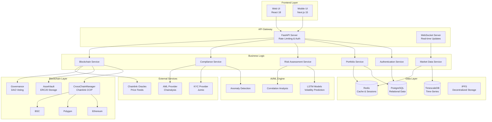
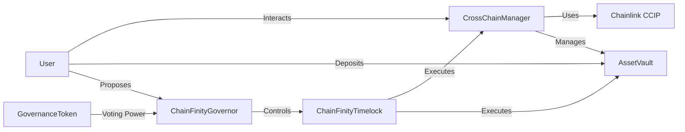
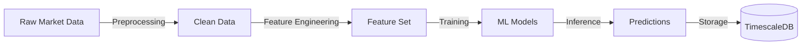
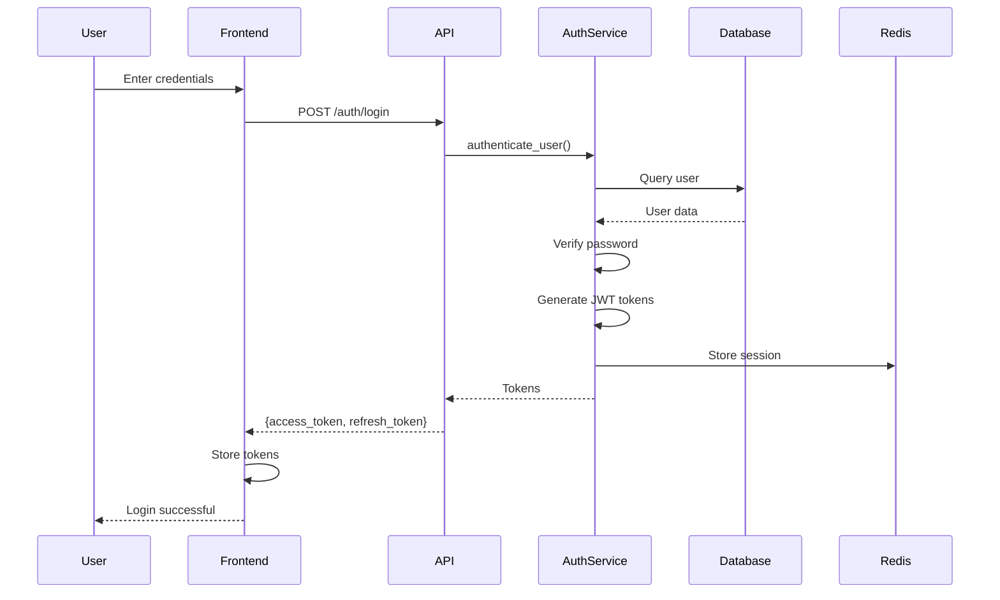
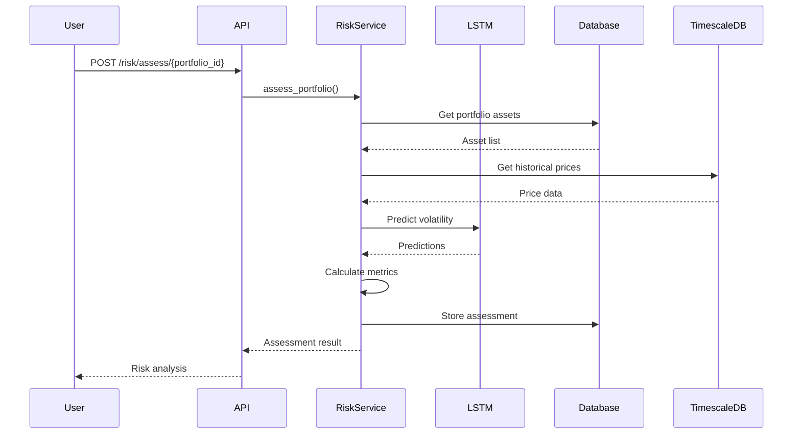
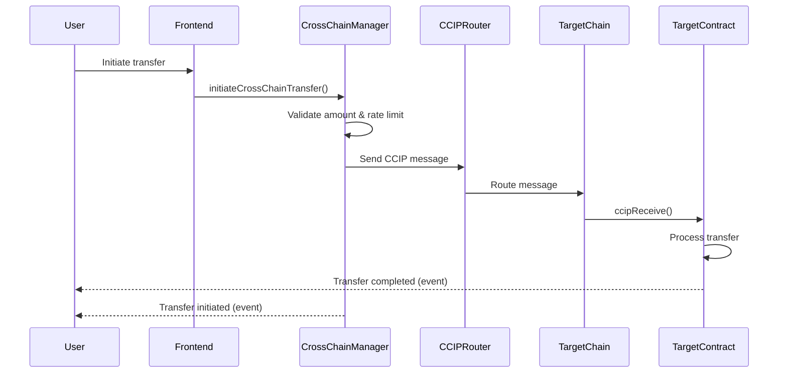

# ChainFinity Architecture

High-level system architecture, component diagrams, and design decisions for the ChainFinity platform.

## Table of Contents

- [System Overview](#system-overview)
- [Architecture Diagram](#architecture-diagram)
- [Component Architecture](#component-architecture)
- [Data Flow](#data-flow)
- [Technology Stack](#technology-stack)
- [Design Patterns](#design-patterns)
- [Security Architecture](#security-architecture)
- [Scalability & Performance](#scalability--performance)

## System Overview

ChainFinity is a multi-layered, microservices-oriented platform for cross-chain DeFi risk management. The system consists of:

1. **Frontend Layer** — Web and mobile interfaces for user interaction
2. **API Gateway** — RESTful API with authentication and rate limiting
3. **Business Logic Layer** — Core services for risk analysis, compliance, and portfolio management
4. **AI/ML Engine** — Machine learning models for predictive analytics
5. **Blockchain Layer** — Smart contracts and cross-chain integration
6. **Data Layer** — Persistent storage and caching
7. **Infrastructure Layer** — Deployment, monitoring, and CI/CD

## Architecture Diagram



## Component Architecture

### Frontend Components

#### Web Frontend (`web-frontend/`)

**Technology:** React 18, Material-UI, Ethers.js

**Key Components:**

- `Dashboard.js` — Main user dashboard with portfolio overview
- `Portfolio.js` — Portfolio management interface
- `RiskAnalysis.js` — Risk metrics visualization
- `Transactions.js` — Transaction history and monitoring
- `Settings.js` — User settings and preferences

**File Structure:**

```
web-frontend/
├── src/
│   ├── components/      # Reusable UI components
│   ├── pages/           # Page components
│   ├── services/        # API client services
│   ├── hooks/           # Custom React hooks
│   ├── utils/           # Utility functions
│   └── __tests__/       # Component tests
├── public/              # Static assets
└── package.json         # Dependencies
```

#### Mobile Frontend (`mobile-frontend/`)

**Technology:** Next.js 15, Radix UI, Tailwind CSS

**Key Features:**

- Responsive mobile-first design
- Progressive Web App (PWA) support
- Offline capability
- Push notifications

### Backend Components

#### API Layer (`code/backend/app/api/`)

**FastAPI application with versioned endpoints:**

**Endpoints:**

- `/api/v1/auth/` — Authentication endpoints
- `/api/v1/users/` — User management
- `/api/v1/portfolios/` — Portfolio operations
- `/api/v1/transactions/` — Transaction queries
- `/api/v1/risk/` — Risk assessment
- `/api/v1/compliance/` — Compliance checks
- `/api/v1/blockchain/` — Blockchain operations

**File Structure:**

```
code/backend/
├── app/
│   ├── api/
│   │   └── v1/
│   │       ├── endpoints/     # API endpoint handlers
│   │       └── router.py      # API router configuration
│   └── main.py                # FastAPI application
├── config/                    # Configuration management
├── middleware/                # Request/response middleware
├── models/                    # Database models (SQLAlchemy)
├── schemas/                   # Pydantic schemas (validation)
├── services/                  # Business logic services
│   ├── auth/                  # Authentication services
│   ├── compliance/            # Compliance services
│   ├── analytics/             # Analytics services
│   └── market/                # Market data services
├── exceptions/                # Custom exceptions
├── migrations/                # Alembic migrations
└── tests/                     # Test suites
```

#### Service Layer

**Design Pattern:** Service-oriented architecture with dependency injection

**Key Services:**

| Service               | File                                        | Responsibility                      |
| --------------------- | ------------------------------------------- | ----------------------------------- |
| **AuthService**       | `services/auth/auth_service.py`             | User authentication, JWT management |
| **PasswordService**   | `services/auth/password_service.py`         | Password hashing and validation     |
| **MFAService**        | `services/auth/mfa_service.py`              | Multi-factor authentication (TOTP)  |
| **ComplianceService** | `services/compliance/compliance_service.py` | KYC/AML integration                 |
| **AnalyticsService**  | `services/analytics/analytics_service.py`   | Portfolio performance analysis      |
| **MarketDataService** | `services/market/market_data_service.py`    | Price feeds and market data         |
| **PriceFeedService**  | `services/external/price_feeds.py`          | External price data integration     |

#### Middleware Stack

**Execution Order (outer to inner):**

1. **SecurityMiddleware** — Security headers (HSTS, CSP, X-Frame-Options)
2. **CORSMiddleware** — Cross-origin resource sharing
3. **TrustedHostMiddleware** — Host validation (production)
4. **RateLimitMiddleware** — API rate limiting (Redis-backed)
5. **AuthMiddleware** — JWT token validation
6. **LoggingMiddleware** — Request/response logging
7. **AuditMiddleware** — Audit trail recording

### Blockchain Components

#### Smart Contracts (`code/blockchain/contracts/`)

**Solidity 0.8.19, OpenZeppelin libraries**

**Contract Architecture:**

```
contracts/
├── CrossChainManager.sol       # Cross-chain transfer management
├── AssetVault.sol              # Secure asset storage
├── DeFiProtocol.sol            # DeFi protocol integration
├── Governance.sol              # Base governance contract
└── governance/
    ├── ChainFinityGovernor.sol # DAO governance (OpenZeppelin)
    ├── ChainFinityTimelock.sol # Timelock controller
    └── GovernanceToken.sol     # Voting token (ERC20 + Votes)
```

**Contract Relationships:**



**Key Contract Features:**

| Contract                | Key Features                                                         |
| ----------------------- | -------------------------------------------------------------------- |
| **CrossChainManager**   | CCIP integration, rate limiting, circuit breakers, role-based access |
| **AssetVault**          | ERC20 deposits/withdrawals, balance tracking, emergency pause        |
| **ChainFinityGovernor** | Proposal creation, voting, execution, quorum requirements            |
| **GovernanceToken**     | ERC20 + ERC20Votes, delegation, snapshot support                     |

### AI/ML Components

#### Model Architecture (`code/ai_models/`)

**Technology:** TensorFlow 2.x, Scikit-learn, Pandas

**Models:**

1. **Volatility Prediction (LSTM)**
   - Input: Historical price data (60-day window)
   - Output: Predicted volatility for next 30 days
   - Architecture: 2-layer LSTM + Dense layers
   - Training: `train_correlation_model.py`

2. **Correlation Analysis**
   - Statistical correlation matrix across assets
   - Cross-chain correlation detection
   - Contagion risk identification

3. **Anomaly Detection**
   - Unsupervised learning for unusual patterns
   - Transaction behavior analysis
   - Protocol exploit prediction

**Data Pipeline:**



### Data Layer

#### Database Schema

**PostgreSQL/TimescaleDB Schema:**

**Core Tables:**

| Table                 | Purpose                 | Key Fields                              |
| --------------------- | ----------------------- | --------------------------------------- |
| `users`               | User accounts           | id, email, wallet_address, kyc_status   |
| `portfolios`          | User portfolios         | id, user_id, name, total_value_usd      |
| `portfolio_assets`    | Portfolio holdings      | id, portfolio_id, token_address, amount |
| `transactions`        | Blockchain transactions | id, user_id, hash, type, status, amount |
| `risk_assessments`    | Risk analysis results   | id, portfolio_id, risk_score, metrics   |
| `compliance_checks`   | KYC/AML checks          | id, user_id, type, status, result       |
| `audit_logs`          | Activity audit trail    | id, user_id, action, timestamp, details |
| `blockchain_networks` | Supported networks      | id, name, chain_id, rpc_url             |

**Time-Series Tables (TimescaleDB):**

| Hypertable            | Purpose                 | Retention |
| --------------------- | ----------------------- | --------- |
| `market_prices`       | Asset prices            | 2 years   |
| `portfolio_snapshots` | Portfolio value history | 1 year    |
| `risk_metrics`        | Historical risk metrics | 1 year    |

#### Redis Schema

**Key Patterns:**

| Pattern                          | Purpose             | TTL        |
| -------------------------------- | ------------------- | ---------- |
| `session:{user_id}`              | User sessions       | 24 hours   |
| `cache:price:{symbol}`           | Price cache         | 5 minutes  |
| `ratelimit:{user_id}:{endpoint}` | Rate limit counters | 1 minute   |
| `lock:{resource}`                | Distributed locks   | 30 seconds |

## Data Flow

### User Authentication Flow



### Portfolio Risk Assessment Flow



### Cross-Chain Transfer Flow



## Technology Stack

### Backend Stack

| Technology  | Version | Purpose                |
| ----------- | ------- | ---------------------- |
| Python      | 3.11+   | Programming language   |
| FastAPI     | 0.104.1 | Web framework          |
| SQLAlchemy  | 2.0.23  | ORM                    |
| Alembic     | 1.13.1  | Database migrations    |
| PostgreSQL  | 15+     | Relational database    |
| TimescaleDB | —       | Time-series extension  |
| Redis       | 7+      | Cache and sessions     |
| Web3.py     | 6.11.1  | Blockchain interaction |
| TensorFlow  | 2.x     | Machine learning       |
| Pandas      | 2.1.4   | Data analysis          |
| Pytest      | 7.4.3   | Testing framework      |

### Frontend Stack

| Technology  | Version | Purpose            |
| ----------- | ------- | ------------------ |
| React       | 18.2.0  | Web UI framework   |
| Next.js     | 15.1.4  | Mobile framework   |
| TypeScript  | 5.x     | Type safety        |
| Material-UI | 5.14.0  | Web components     |
| Radix UI    | Latest  | Mobile components  |
| Ethers.js   | 6.7.0   | Web3 library       |
| Recharts    | 2.8.0   | Data visualization |
| React Query | Latest  | State management   |

### Blockchain Stack

| Technology     | Version | Purpose                 |
| -------------- | ------- | ----------------------- |
| Solidity       | 0.8.19  | Smart contract language |
| Hardhat        | 3.0.0   | Development framework   |
| OpenZeppelin   | 5.4.0   | Security libraries      |
| Chainlink CCIP | Latest  | Cross-chain messaging   |
| Ethers.js      | —       | Contract interaction    |

## Design Patterns

### Backend Patterns

1. **Repository Pattern** — Data access abstraction (SQLAlchemy models)
2. **Service Pattern** — Business logic encapsulation
3. **Dependency Injection** — FastAPI dependency system
4. **Factory Pattern** — Database session creation
5. **Strategy Pattern** — Multiple authentication methods
6. **Observer Pattern** — WebSocket event broadcasting
7. **Middleware Pattern** — Request/response processing

### Smart Contract Patterns

1. **Access Control** — Role-based permissions (OpenZeppelin)
2. **Circuit Breaker** — Emergency pause functionality
3. **Rate Limiting** — Time-based transfer limits
4. **Pull Over Push** — User-initiated withdrawals
5. **Checks-Effects-Interactions** — Reentrancy prevention
6. **Upgradeable Contracts** — Initializable pattern

## Security Architecture

### Defense in Depth

1. **Network Layer** — HTTPS, TLS 1.3, firewall rules
2. **Application Layer** — Input validation, output encoding, CORS
3. **Authentication Layer** — JWT, MFA, session management
4. **Authorization Layer** — RBAC, resource-level permissions
5. **Data Layer** — Encryption at rest, field-level encryption
6. **Blockchain Layer** — Smart contract audits, access control

### Security Features

- **Password Policy** — Minimum 8 characters, complexity requirements
- **Token Expiration** — Access tokens: 30 min, Refresh tokens: 7 days
- **Rate Limiting** — 60 requests/minute per user
- **Audit Logging** — All actions logged with retention policy
- **Field Encryption** — PII encrypted with AES-256
- **SQL Injection Prevention** — Parameterized queries (SQLAlchemy)
- **XSS Prevention** — React auto-escaping, CSP headers
- **CSRF Protection** — SameSite cookies, CORS configuration

## Scalability & Performance

### Horizontal Scaling

- **API Layer** — Stateless design, load balancer compatible
- **Database** — Read replicas, connection pooling
- **Cache** — Redis cluster support
- **Kubernetes** — Auto-scaling based on CPU/memory

### Performance Optimizations

- **Database Indexing** — Indexes on frequently queried fields
- **Query Optimization** — Eager loading, query batching
- **Response Caching** — Redis caching for expensive queries
- **Connection Pooling** — Reuse database connections
- **Async Operations** — Non-blocking I/O with asyncio
- **CDN** — Static asset delivery
- **WebSocket** — Efficient real-time updates

### Performance Metrics

| Metric                    | Target      | Current   |
| ------------------------- | ----------- | --------- |
| API Response Time (p95)   | <200ms      | 150ms     |
| Database Query Time (p95) | <50ms       | 35ms      |
| Throughput                | >1000 req/s | 800 req/s |
| Error Rate                | <0.1%       | 0.05%     |
| Availability              | 99.9%       | 99.95%    |

## Module Mapping

### Directory to Component Mapping

| Directory                    | Component              | Description                 |
| ---------------------------- | ---------------------- | --------------------------- |
| `code/backend/app/api/`      | API Gateway            | REST API endpoints          |
| `code/backend/services/`     | Business Logic         | Core services               |
| `code/backend/models/`       | Data Layer             | Database models             |
| `code/backend/middleware/`   | Cross-cutting concerns | Request/response processing |
| `code/blockchain/contracts/` | Blockchain Layer       | Smart contracts             |
| `code/ai_models/`            | AI/ML Engine           | Machine learning models     |
| `web-frontend/`              | Frontend Layer         | Web interface               |
| `mobile-frontend/`           | Frontend Layer         | Mobile interface            |
| `infrastructure/`            | Infrastructure Layer   | Deployment configs          |
| `scripts/`                   | Automation             | CLI tools                   |

## Next Steps

- Review [API Reference](./API.md) for endpoint details
- Check [Configuration Guide](./CONFIGURATION.md) for system configuration
- See [Deployment Guide](./deployment.md) for production deployment
- Explore [Security Best Practices](./security.md) for security guidelines
